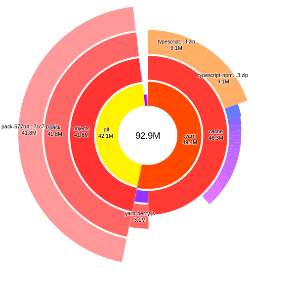

# Review notes

## Tentando Rodar

Primeira coisa que percebi, foi quando clonei o repositório:
```bash
Receiving objects: 100% (1023/1023), 41.78 MiB | 1004.00 KiB/s, done.
```

Deu 41MB só no git clone, vamos ver o projeto:



Claro, pensei: _"ah, ele deve ter esquecido de botar o .yarn no .gitignore"_, só que daí vi o .gitignore
e vi que tava explícito pra não ignorar o .yarn/cache, nunca tinha visto esse padrão, é pra ser mais rápido o `yarn install`?

Mesmo assim, ficou um pouco estranho clonar um repositório pequeno e ter 42MB de bloat tanto vindo do `.git` quanto do `.yarn/cache`.
Se visse em algum lugar pode compartilhar o link, porque fiquei curioso :)

---

Segunda coisa que notei foi que não tinha um `README.md` não sabendo muito como rodar o projeto, se é por `docker-compose up` um `ts-node packages/api/src/index.ts`.

Também faltou o `README` pra explicar o projeto, porque foi decidido algumas questões estruturais de um jeito e não de outro, por exemplo.

Daqui em diante, assumi que se roda com `docker-compose up` e que vai subir um servidor em alguma porta.

---

Ao rodar o comando me deparo com vários warnings pedindo pra eu passar algumas variáveis de ambiente ao rodar o `docker-compose`:

```
WARNING: The REPO_MOUNT_POINT variable is not set. Defaulting to a blank string.
WARNING: The BASE_IMAGE_NAME variable is not set. Defaulting to a blank string.
WARNING: The DB_HOST_PORT variable is not set. Defaulting to a blank string.
WARNING: The DB_CONTAINER_PORT variable is not set. Defaulting to a blank string.
WARNING: The API_CONTAINER_PORT variable is not set. Defaulting to a blank string.
WARNING: The API_HOST_PORT variable is not set. Defaulting to a blank string.
```

Assumi alguns valores default, rodei de novo:

`REPO_MOUNT_POINT=$(pwd) BASE_IMAGE_NAME="test"  API_HOST_PORT=3000 API_CONTAINER_PORT=3000 DB_HOST_PORT=3030 DB_CONTAINER_PORT=3030 docker-compose up`

E me vem um erro de que não achou o arquivo `ps.env`. De novo assumindo que se trata do arquivo de configuração
das env vars do Postgres(olha quantas camadas de assumption tive que fazer, por isso a importância de um `README`)

Criei um arquivo vazio `ps.env`, rodo de novo, vem outro erro de que não achou o arquivo `packages/api/.env`;
Criei um arquivo vazio `packages/api/.env`, rodo de novo, sobe os serviços dá crash no container da `api` e o do `db` nem subiu;
Boto `POSTGRES_PASSWORD=secret` no `ps.env`, `db` subiu, `api`, não se conectou ao DB direito;
Boto `DATABASE_URL=postgres://postgres:secret@db:3030` no `packages/api/.env`;
`api` pegou a configuração, porém não achou nada na porta `3030`, volto pra porta default do posgres, e rodo:

`REPO_MOUNT_POINT=$(pwd) BASE_IMAGE_NAME="test"  API_HOST_PORT=3000 API_CONTAINER_PORT=3000 DB_HOST_PORT=5432 DB_CONTAINER_PORT=5432 docker-compose up`, mudando no .env também.

Finalmente servidor rodou e se conectou e me deu a mensagem:

```
api_1   | 🚀 Server ready at http://localhost:4000/
```

Mas, não tem nada na porta 3000... vamos rodar de novo o comando com a porta 4000 como default

`REPO_MOUNT_POINT=$(pwd) BASE_IMAGE_NAME="test"  API_HOST_PORT=4000 API_CONTAINER_PORT=4000 DB_HOST_PORT=5432 DB_CONTAINER_PORT=5432 docker-compose up`

Agora deu certo, mas porque dar tantas configurações, se elas não vão configurar nada e tem que ser um número específico?

## Review do código

Pontos gerais notados:
- Foi legal que Typescript ter usado;
- Foi positivo ter documentado as mudanças no código no git;
- A mutation de `installStation` não foi implementada;
- Testes não foram implementados;
- Sem explicação do porque ter usado as libs que foram usadas, e documentação;
- Gostei de ter tido a iniciativa de ter posto paginação, porém o cursor retornado não funciona, pois ele sempre é resetado pra 1;
- Achei _interessante_ a ideia do async generator pra pegar os planetas;
- Achei _interessante_ a estrutura do projeto, pra projetos mais massivos.

### Async Generator

Pareceu que o async generator foi uma solução "too smart", pareceu um pouco engessada, não se adequando muito ao problema, como eu vou comentar em seguida:

Como comentado no `./packages/api/src/lib/pagination-flat-generator.ts` do jeito que foi implementado sempre quando instanciado o _generator_,
ele vai dar fetch em todas as requests, e a parte do _generator_ só pareceu um syntactic sugar complicado de entender 
por cima do que poderia ser um simples:

```typescript
const planets = await Promise.all(getPlanets)
const suitablePlanets = planets.filter(hasSuitableMass).slice(0, desiredAmount)
```

Desse jeito, entendo que o async generator possa resolver uns problemas bem interessantes, mas nesse caso
a sua complexidade não ajudou a resolver o problema de forma nem mais rápida, nem mais "bonita"/curta pra quem utiliza ele.

Dessa forma, entendo que o projeto já utilizou dele, portanto o code review no código vai se atentar a como se poderia melhorar e encurtar o código respectivo ao generator.

## TL;DR

Parece que o projeto foi needlessly complicated, tanto em bibliotecas(graphile, não entendi o .pnp.js, codegen), estrutura(dividir em packages, pasta .yarn cacheada), código (async generator, pagination).

Entendo que é interessante mostrar o quanto sabemos, mas também temos que perceber o quanto essas ferramentas se adequam ao problema e quanto elas as resolvem bem.
Não adianta usar uma máquina industrial de corte a diamante, pra abrir um pacote de ketchup, as vezes é mais difícil fazer o setup e a manutenção da máquina toda,
pra um problema que é inerentemente mais simples e pode ser resolvido com algo bem mais fácil de entender por todos.

Pois nesse caso, o código ficou difícil de ler, e a response time ficou lenta. Não teve muita vantagem a complexidade do código então.

Fora isso, deu de ver que foi posto um esforço considerável na hora de fazer o setup do projeto, de fazer o mega-ultra-genérico async generator com paginação,
e tem-se um conhecimento avançado no JS/TS.

O meu maior ponto de atenção pra melhoria seriam realmente:
- Será que essa ferramenta, que sim, parece muito massa, muito ultra-genérica e tudo, mas será que essa ferramenta vai atender ao problema de forma satisfatória?
  Tanto pro código ficar simples(_note_: simples != burro), quanto pra atender aos requisitos de uso(response-time)

Fora isso acho que você tem um grande conhecimento técnico!